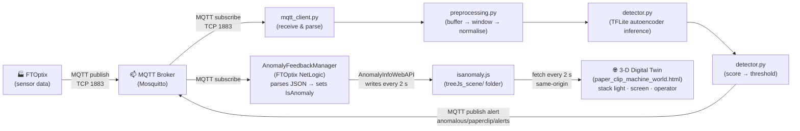

# Anomaly Detection on a Paper-Clip Machine — A Learning Tutorial

> **What is this?** A simple, self-contained project that teaches you how to detect anomalies in industrial sensor data using a lightweight neural network, MQTT messaging, and Docker. The target deployment platform is the **NXP i.MX 8M Plus** (ARM Cortex-A53) edge controller, which carries an on-chip Neural Processing Unit (NPU). Inference runs on **TensorFlow Lite** because it integrates with the NXP eIQ/VSI delegate stack used on this target platform. Currently the NPU is not yet enabled; the application runs on the ARM CPU. Everything is designed to run in a Docker container on a low-power edge device with no GPU.

---

## Table of Contents

1. [Introduction](#1-introduction)
2. [Background Concepts](#2-background-concepts)
3. [How the Algorithm Works](#3-how-the-algorithm-works)
4. [Architecture & Data Flow](#4-architecture--data-flow)
5. [Project Walkthrough](#5-project-walkthrough)
6. [Decision Log](#6-decision-log)
7. [How to Run](#7-how-to-run)
8. [Experimenting & Next Steps](#8-experimenting--next-steps)
9. [Glossary](#9-glossary)

---

## 1. Introduction

### What is this project?

This project monitors a **paper-clip manufacturing machine** — a line that feeds steel wire, bends it into paper-clip shape, cuts it, and packages it. Sensors on the machine produce readings (motor current, temperature, vibration, etc.) once per second. Our Python application subscribes to those readings over MQTT, feeds them to a small neural network called an **autoencoder**, and raises an alert when the sensor pattern looks abnormal.

### Who is it for?

Developers and engineers who want to understand:

- How machine learning can detect equipment problems in real time
- How MQTT works for industrial data
- How to package an ML application in Docker for edge deployment

**Prerequisite**: Basic Python knowledge. No ML or IoT experience required — this README teaches everything from scratch.

### What will you learn?

- **MQTT**: publish/subscribe messaging for IoT
- **Anomaly detection**: finding unusual patterns without labelled examples
- **Autoencoders**: a type of neural network that learns "normal" and flags deviations
- **Data preprocessing**: windowing, averaging, and normalisation
- **Edge deployment**: running ML in a Docker container on a small device

---

## 2. Background Concepts

### 2.1 What is MQTT?

**MQTT** (Message Queuing Telemetry Transport) is a lightweight messaging protocol designed for devices with limited power and bandwidth — exactly the kind of devices found in factories.

It uses a **publish/subscribe** pattern:

```
                         ┌───────────────┐
  FTOptix (publisher) ──►│  MQTT Broker  │──► Anomaly Detector (subscriber)
                         └───────────────┘
```

- **Publisher**: a device or application that *sends* messages to a **topic** (like a channel name).
- **Broker**: a server that *receives* messages and *forwards* them to anyone subscribed to that topic.
- **Subscriber**: an application that *listens* on a topic and receives messages as they arrive.

**Why MQTT for industrial IoT?**

| Feature | Why it matters |
|---|---|
| Tiny overhead | Works on constrained devices and slow networks |
| Decoupled | Publisher doesn't need to know who's listening |
| Reliable | Supports QoS levels (0 = fire-and-forget, 1 = at least once, 2 = exactly once) |

In our project, **Rockwell Automation FTOptix** publishes sensor data to the topic `ftoptix/paperclip/sensors`. Our detector subscribes to that topic and processes each message.

### 2.2 What is Anomaly Detection?

Anomaly detection answers the question: **"Is this data point normal or unusual?"**

**Real-world examples:**

- A credit card company flags a transaction in a country you've never visited → anomaly
- A machine's motor current spikes 3× higher than usual → anomaly
- A server suddenly starts using 100% CPU at 3am → anomaly

There are two broad approaches:

| Approach | How it works | Needs labelled anomalies? |
|---|---|---|
| **Supervised** | Train on examples of "normal" AND "anomaly" | Yes — you need lots of labelled examples of both |
| **Unsupervised** | Train only on "normal" data; anything that doesn't fit is flagged | No — just normal data |

We use the **unsupervised** approach because in real factories it's easy to collect hours of normal operation data but very hard (and dangerous) to deliberately cause failures just to get labelled examples.

### 2.3 What is Edge Computing?

**Edge computing** means running computation *close to where the data is produced* — on the factory floor, not in a remote cloud data centre.

**Why run ML on the edge?**

| Advantage | Explanation |
|---|---|
| **Low-latency inference** | Run model inference in milliseconds on-device (no cloud round-trip). End-to-end detection cadence is still window-based (30 samples at 1 Hz by default). |
| **Works offline** | The machine keeps being monitored even if the internet goes down |
| **Data privacy** | Sensitive production data stays on-site |
| **Bandwidth savings** | Send only alerts to the cloud, not thousands of raw readings per second |

**Trade-off**: Edge devices have limited CPU and RAM, so the model must be small and efficient. That's why we use a tiny autoencoder with about 3,482 parameters instead of a large deep-learning model.

### 2.4 What is Docker? (briefly)

**Docker** packages your application and all its dependencies into a **container** — a lightweight, portable box that runs the same way on your laptop, a server, or an edge device.

Think of it like shipping: instead of sending loose items and hoping the recipient has the right shelves, you ship a sealed container with everything inside.

For this project, Docker means:

- You don't need to install Python, TFLite runtime, or paho-mqtt on the edge device
- You just copy the Docker image and run it
- `docker compose up` starts both the MQTT broker and the detector container

---

## 3. How the Algorithm Works

### 3.1 Intuition: The Photocopier Analogy

Imagine a photocopier that has only ever seen pictures of cats.  After copying thousands of cat pictures, it becomes *really good* at reproducing them accurately.

Now feed it a picture of a dog. The copier doesn't know what a dog is — it tries to make it look like a cat. The copy comes out blurry and distorted.

**The key insight**: if the copy is bad, the input was probably not a cat.

An **autoencoder** works the same way:

- **Training**: show it thousands of examples of normal machine behaviour.
- **Inference**: feed it a new reading. If the reconstruction is *close* to the input → **normal**. If the reconstruction is *far* from the input → **anomaly**.

### 3.2 The Math

The autoencoder has two parts: an **encoder** that compresses the data, and a **decoder** that reconstructs it.

**The actual architecture** (not a simple compression):

```
Input Layer    →  Hidden Layer  →  Bottleneck   →  Hidden Layer  →  Output Layer
10 values      →  64 neurons    →  16 neurons   →  64 neurons    →  10 values
   (x)              (expand)        (compress)       (expand)         (x̂)
```

**Why expand first (10→64) before compressing (64→16)?**

The network doesn't work with the raw 10 sensor values directly. Instead:
- **First layer (10→64)**: creates 64 "internal features" — combinations like "high motor current AND high vibration" or "slow feed speed AND high tension." These capture complex relationships between sensors.
- **Bottleneck (64→16)**: forces the network to keep only the 16 most essential patterns that describe "normal" behavior. This is the real compression.
- **Reconstruction (16→64→10)**: rebuilds the original 10 values from those 16 core patterns.

If the network learned well, it can accurately reconstruct normal data from just 16 values. Abnormal data won't fit these 16 patterns, so reconstruction fails → high error → anomaly detected.

---

**Encoder** — compresses through two layers:

1. First layer: expand 10 inputs to 64 features
   $$h_1 = \text{ReLU}(W_1 \cdot x + b_1)$$

2. Second layer: compress 64 features to 16 (the bottleneck)
   $$z = \text{ReLU}(W_2 \cdot h_1 + b_2)$$

Combined: $$z = \text{ReLU}(W_2 \cdot \text{ReLU}(W_1 \cdot x + b_1) + b_2)$$

**Decoder** — reconstructs the original 10 values from the 16:

3. Third layer: expand bottleneck back to 64
   $$h_3 = \text{ReLU}(W_3 \cdot z + b_3)$$

4. Fourth layer: output 10 reconstructed values
   $$\hat{x} = \sigma(W_4 \cdot h_3 + b_4)$$

Combined: $$\hat{x} = \sigma(W_4 \cdot \text{ReLU}(W_3 \cdot z + b_3) + b_4)$$

---

**Symbol Reference:**

| Symbol | Meaning |
|---|---|
| $x$ | Input: 10 normalised sensor values (one reading from the machine) |
| $h_1$ | Hidden layer: 64 intermediate features (learned combinations of sensors) |
| $z$ | Bottleneck: 16 compressed values (the "essence" of normal behavior) |
| $h_3$ | Hidden layer: 64 features being reconstructed |
| $\hat{x}$ | Output: the reconstruction (same size as $x$, ideally very close to $x$) |
| $W_i, b_i$ | Learned weights and biases (the "knowledge" the network gained during training) |
| $\text{ReLU}(v) = \max(0, v)$ | Activation function: keeps positive values, zeros out negatives (explained below) |
| $\sigma(v) = \frac{1}{1 + e^{-v}}$ | Sigmoid: squashes any value to range $[0, 1]$ to match normalised inputs |

---

**What is ReLU?**

ReLU stands for **Rectified Linear Unit**. It's a simple mathematical function:

$$\text{ReLU}(v) = \max(0, v) = \begin{cases} v & \text{if } v > 0 \\ 0 & \text{if } v \leq 0 \end{cases}$$

**Examples:**
- $\text{ReLU}(-5.0) = 0$
- $\text{ReLU}(-0.1) = 0$
- $\text{ReLU}(0) = 0$
- $\text{ReLU}(2.5) = 2.5$
- $\text{ReLU}(100) = 100$

**Why do we need it?** Without ReLU (or another "activation function"), the neural network would just be a series of matrix multiplications — essentially a fancy linear equation that can only learn straight-line relationships. ReLU adds **non-linearity**, allowing the network to learn curves, thresholds, and complex patterns like "IF motor current > threshold AND vibration > threshold THEN something significant is happening."

**Analogy:** Think of ReLU like a one-way valve. Water (data) can flow forward when pressure is positive, but when pressure is negative, the valve closes (output = 0). This selective behavior helps the network learn which features matter in different situations.

---

**Anomaly score** — Mean Squared Error between input and reconstruction:

$$\text{MSE} = \frac{1}{10} \sum_{i=1}^{10} (x_i - \hat{x}_i)^2$$

**What does this formula do?**

1. For each of the 10 sensors: compute the difference between input $x_i$ and reconstruction $\hat{x}_i$
2. Square each difference: $(x_i - \hat{x}_i)^2$ — this makes all errors positive and penalizes large errors more than small ones
3. Sum all 10 squared differences
4. Divide by 10 to get the average

**Example with normal data:**

| Sensor | Input $x_i$ | Reconstructed $\hat{x}_i$ | Difference | Squared $(x_i - \hat{x}_i)^2$ |
|---|---|---|---|---|
| wire_feed_speed | 0.50 | 0.51 | -0.01 | 0.0001 |
| wire_tension | 0.75 | 0.74 | 0.01 | 0.0001 |
| motor_current_feed | 0.60 | 0.62 | -0.02 | 0.0004 |
| ... (7 more) | ... | ... | ... | 0.0014 |

Sum of squares = 0.0001 + 0.0001 + 0.0004 + 0.0014 = 0.0020
**MSE = 0.0020 / 10 = 0.0002** ← small error = good reconstruction = **normal**

**Example with anomalous data:**

| Sensor | Input $x_i$ | Reconstructed $\hat{x}_i$ | Difference | Squared $(x_i - \hat{x}_i)^2$ |
|---|---|---|---|---|
| motor_current_feed | 0.95 | 0.60 | 0.35 | 0.1225 |
| vibration_rms | 0.90 | 0.30 | 0.60 | 0.3600 |
| temperature_motor | 0.85 | 0.55 | 0.30 | 0.0900 |
| ... (7 more) | ... | ... | ... | 0.0080 |

Sum of squares = 0.1225 + 0.3600 + 0.0900 + 0.0080 = 0.5805
**MSE = 0.5805 / 10 = 0.05805** ← large error = bad reconstruction = **anomaly!**

---

**Threshold** — set during training as:

$$\text{threshold} = \mu_{\text{MSE}} + 3 \cdot \sigma_{\text{MSE}}$$

Where $\mu_{\text{MSE}}$ is the **mean** (average) MSE on training data, and $\sigma_{\text{MSE}}$ is the **standard deviation** (how spread out the MSE values are).

**What is the "three-sigma rule"?**

This rule comes from the **Gaussian distribution** (also called **normal distribution** or **bell curve**), a pattern that appears throughout nature and engineering:

```
    Frequency (how often we see each MSE value)
         ↑
         │               ╱───╲
         │             ╱       ╲          ← Peak: most samples have MSE near the mean
         │           ╱           ╲
         │         ╱               ╲
         │       ╱                   ╲
         │_____╱                       ╲_____
    ─────┴────┬──────┬─────┬───┬─────┬──────┬────→ MSE value
              │      │     │   │     │      │
            μ-3σ   μ-2σ  μ-1σ μ  μ+1σ  μ+2σ  μ+3σ
              │            ↑             │
              │          Mean            │
              │    (average MSE on       │
              │     normal data)         │
              │                          │
              └──────────────────────────┘
                99.7% of normal samples
                    fall in this range


    Understanding the ranges:

    ├────────┤           68% within  μ ± 1σ  (1 standard deviation from mean)
    ├──────────────────┤ 95% within  μ ± 2σ  (2 standard deviations)
    ├────────────────────────────┤ 99.7% within μ ± 3σ  (3 standard deviations)


    Our threshold = μ + 3σ  (right edge of the 99.7% range)
    → Any MSE above this is in the extreme 0.3% tail → ANOMALY!
```

**Key properties of a Gaussian distribution:**

- **68%** of values fall within $\mu \pm 1\sigma$ (within 1 standard deviation)
- **95%** of values fall within $\mu \pm 2\sigma$ (within 2 standard deviations)
- **99.7%** of values fall within $\mu \pm 3\sigma$ (within 3 standard deviations)

**What this means for our detector:**

During training on 10,000 normal samples, suppose we find:
- Mean MSE ($\mu$) = 0.0010
- Standard deviation ($\sigma$) = 0.0008

Then: **threshold** = $0.0010 + 3 \times 0.0008 = 0.0010 + 0.0024 = 0.0034$

**Interpretation:** 99.7% of normal operations have MSE below 0.0034. If a new sample has MSE > 0.0034, it's in the extreme 0.3% tail of the distribution — **statistically very unusual** — so we flag it as an anomaly.

**Why 3 sigma specifically?**

| Threshold | False alarm rate | Trade-off |
|---|---|---|
| $\mu + 2\sigma$ | ~5% (1 in 20 samples) | Too many false alarms |
| $\mu + 3\sigma$ | ~0.3% (1 in 370 samples) | **Good balance** |
| $\mu + 4\sigma$ | ~0.006% (1 in 15,000 samples) | Might miss real problems |

The 3-sigma rule is the engineering sweet spot: sensitive enough to catch real anomalies, but not so sensitive that you get false alarms every few minutes.

### 3.3 Training vs. Inference

| | Training (offline, once) | Inference (real-time, continuous) |
|---|---|---|
| **Input** | CSV of normal data | Live MQTT sensor readings |
| **Goal** | Learn to reconstruct normal data well | Check if new data is normal or not |
| **Output** | Saved model weights + threshold | Anomaly score + alert |
| **Runs** | On your laptop | On the edge device in Docker |

---

## 4. Architecture & Data Flow



**Step by step:**

1. **FTOptix** reads 10 sensors on the paper-clip machine and publishes a JSON message every second to `ftoptix/paperclip/sensors`.

2. **MQTT Broker** (Mosquitto, running in its own container) receives the message and delivers it to all subscribers.

3. **mqtt_client.py** receives the raw message, parses the JSON, and hands the sensor dictionary to the callback defined in `main.py`.

4. **preprocessing.py** buffers 30 messages (= 30 seconds), averages them into a single vector of 10 values, and normalises each value with the saved scaler.

5. **detector.py** feeds the normalised vector through the TFLite autoencoder and reads the reconstruction.

6. **detector.py** computes the MSE between the original and the reconstruction. If MSE > threshold → anomaly. The result is published back to the MQTT broker on topic `anomaly/paperclip/alerts`.

7. **AnomalyFeedbackManager** (a FTOptix NetLogic) subscribes to `anomaly/paperclip/alerts`, parses the JSON payload, and writes the `IsAnomaly` boolean into the FTOptix information model.

8. **AnomalyInfoWebAPI** (a second FTOptix NetLogic) runs a `PeriodicTask` every 2 seconds. It reads `IsAnomaly` from the model and writes it as a tiny JSON payload into `treeJs_scene/isanomaly.js` on disk.

9. **The 3-D digital twin** (`paper_clip_machine_world.html`, served by FTOptix's embedded WebPresentationEngine on port 8080) polls `./isanomaly.js` every 2 seconds with a relative `fetch()`. When the flag is `true`, the scene reacts: the stack light turns red, the HMI screen blinks red, and the operator character moves faster.

   **Why a file and not a direct HTTP call?** FTOptix's WebBrowser enforces a strict Content Security Policy (`default-src 'self'`). Any fetch to a different port — even on the same host — is a different origin and is blocked. A relative fetch to a file in the same served folder is always same-origin and requires no special configuration. See the [Decision Log](#6-decision-log) for the full rationale.

---

## 5. Project Walkthrough

### File-by-file guide

| File | Purpose | Key concept |
|---|---|---|
| `config.yaml` | All tuneable parameters in one place | Centralised configuration |
| `src/main.py` | Entry point — wires everything together | Application "conductor" |
| `src/mqtt_client.py` | MQTT subscribe + publish helpers | Pub/sub messaging |
| `src/preprocessing.py` | Buffer samples, window, normalise | Feature engineering |
| `src/model.py` | Autoencoder neural network definition | The ML model itself |
| `src/detector.py` | Compute anomaly score vs. threshold | Decision logic |
| `training/generate_synthetic.py` | Create fake sensor data | Synthetic data generation |
| `training/train.py` | Train the autoencoder offline | Model training |
| `Dockerfile` | Single arm64 recipe for edge deployment | Containerisation |
| `docker-compose.yml` | Run broker + detector together (TCP 1883 required; WebSocket 9001 reserved, unused) | Multi-container orchestration |
| `FTOptix/…/ThePaperClipMachineSimulator.cs` | FTOptix NetLogic — generates the 10 simulated sensor tags and publishes them via MQTT every second. Includes an `[ExportMethod]` to inject an anomaly on demand | Sensor simulation |
| `FTOptix/…/AnomalyFeedbackManager.cs` | FTOptix NetLogic — subscribes to the MQTT alert topic, parses the JSON payload, and sets `Model/IsAnomaly` | MQTT → OPC UA bridge |
| `FTOptix/…/AnomalyInfoWebAPI.cs` | FTOptix NetLogic — `PeriodicTask` writes `isanomaly.js` every 2 s from `Model/IsAnomaly` | File-based state export |
| `FTOptix/…/paper_clip_machine_world.html` | 3-D digital twin entry point (Three.js scene), served by FTOptix WebPresentationEngine on port 8080 | Live browser visualisation |
| `FTOptix/…/js/hydrate.js` | Initialises HTML elements from `window.CONTENT` at page load. Extracted from inline `<script>` to satisfy CSP `script-src 'self'` | CSP-compliant hydration |
| `FTOptix/…/js/content.js` | Editable text content for labels, walkthrough text, and stack panel | Content / configuration |
| `FTOptix/…/treeJs_scene/isanomaly.js` | Runtime file written by `AnomalyInfoWebAPI`. Contains `{"isAnomaly":true/false}`. The `.js` extension is required because FTOptix's web server blocks `.json` file downloads | Anomaly state handshake |

### The 10 Most Important Lines of Code

**1. The autoencoder bottleneck** (`src/model.py`):
```python
tf.keras.layers.Dense(bottleneck_size, activation="relu")
```
This is where the magic happens: the network is forced to compress 64 numbers into 16, learning only the most essential patterns.

**2. Buffer emits a window** (`src/preprocessing.py`):
```python
if len(self.samples) == self.window_size:
    window = np.asarray(self.samples, dtype=np.float32)
    self.samples.clear()
    return window
```
Samples accumulate one by one until we have a full window (30 samples), then the buffer resets.

**3. Window averaging** (`src/preprocessing.py`):
```python
return window.mean(axis=0)
```
Collapses 30 samples × 10 tags into one vector of 10 averaged values — smooths noise while keeping the signal.

**4. Normalisation** (`src/preprocessing.py`):
```python
scaled = scaler.transform(feature_vector.reshape(1, -1))
```
The scaler (fitted during training) maps raw values to [0, 1] so no single tag dominates due to its scale.

**5. TFLite inference** (`src/detector.py`):
```python
interpreter.set_tensor(input_details[0]["index"], input_data)
interpreter.invoke()
reconstructed = interpreter.get_tensor(output_details[0]["index"])[0]
```
Write the input, run the model, read the output — the three-line essence of TFLite inference.

**6. Anomaly score** (`src/detector.py`):
```python
return float(np.mean((original - reconstructed) ** 2))
```
The reconstruction error: low for normal, high for anomalous.

**7. Threshold check** (`src/detector.py`):
```python
return DetectionResult(score > threshold, score, threshold)
```
The decision is still one comparison: is the reconstruction error higher than what we saw during training?

**8. Subscribe on connect** (`src/mqtt_client.py`):
```python
client.subscribe(sensor_topic)
```
Tells the broker: "send me every message on this topic." Done inside `on_connect` so it automatically re-subscribes after reconnection.

**9. Keras training call** (`training/train.py`):
```python
model.fit(x=scaled_data, y=scaled_data, epochs=..., batch_size=...)
```
One call replaces the manual training loop. Keras handles shuffling, batching, forward pass, gradient computation, and weight update on every epoch. The autoencoder's target is its own input (`y=scaled_data`).

**10. Threshold calculation** (`training/train.py`):
```python
threshold = mse_mean + sigma * mse_std
```
The three-sigma rule: anything more than 3 standard deviations above mean training error is an anomaly.

---

## 6. Decision Log

| Decision | Choice | Why | Alternative Considered |
|---|---|---|---|
| Algorithm | Autoencoder | Learns multivariate patterns; intuitive anomaly score (reconstruction error); great for teaching | Isolation Forest — simpler but treats samples independently, less to learn |
| Framework | TensorFlow Lite (TFLite) | Chosen for this project because it integrates with the NXP eIQ/VSI delegate stack on the i.MX 8M Plus target, `tflite-runtime` on the edge device is only a few MB, and it provides a clear split between training (full TF/Keras, dev machine) and inference (TFLite, edge device) | PyTorch — no NPU delegate in this project stack; scikit-learn — can’t easily define custom neural nets |
| Preprocessing | Window averaging (30s, no overlap) | Simple, smooths noise, keeps model input small (10 features) | Raw samples — noisy; sliding window with overlap — adds complexity without much benefit for a tutorial |
| Normalisation | MinMaxScaler to [0, 1] | Matches Sigmoid output; prevents scale imbalance | StandardScaler (z-score) — works too, but [0,1] matches Sigmoid naturally |
| Threshold | mean + 3σ | Classic, easy to explain, well-understood | Fixed threshold — doesn't adapt; percentile — needs more data |
| MQTT QoS | Level 1 (at least once) | Don't lose alerts; QoS 2 adds unnecessary overhead | QoS 0 — might lose alerts; QoS 2 — overkill |
| Docker base | python:3.11-slim | Small image, no compilation issues with pip | Alpine — smaller but C-extension installs often fail |
| Runtime target | ARM64 only | Matches the NXP i.MX 8M Plus deployment target and keeps the runtime stack simple (`tflite-runtime` only) | Multi-arch image logic — more complexity for this tutorial |
| Build platform | `platform: linux/arm64` in `docker-compose.yml` + `FROM --platform=${TARGETPLATFORM:-linux/arm64}` | Keeps build and runtime architecture explicit and consistent | Implicit platform selection — can pull the wrong architecture image |
| Anomaly state → browser | Write `isanomaly.js` to `treeJs_scene/`; browser polls with `fetch('./isanomaly.js')` every 2 s | FTOptix's WebBrowser enforces `default-src 'self'` CSP. Any fetch to a different port (e.g. `http://host:8085/...`) is a cross-origin request and is blocked, even on the same machine. A relative fetch inside the served folder is always same-origin. Worst-case update lag is 4 s (write interval + poll interval), which is acceptable for a visual indicator | `HttpListener` on a dedicated port — blocked by CSP; WebSocket — also cross-origin; MQTT over WebSocket in-browser — requires adding `connect-src ws://...` to the CSP, which is not configurable without access to the FTOptix web server config |
| `.js` extension for the state file | `isanomaly.js` instead of `isanomaly.json` | FTOptix's embedded web server returns 403 for `.json` files — they are on an internal deny list to protect FTOptix project configuration files. Using `.js` avoids the block. The content is still valid JSON; the browser reads it as text and calls `JSON.parse()` explicitly | Rename to `.txt` — also works, but `.js` is more self-documenting in the context of a JS project |

---

## 7. How to Run

### Prerequisites

| Tool | Version | Notes |
|---|---|---|
| [Podman](https://podman.io/) | ≥ 5.0 | Container engine (Docker also works — replace `podman` with `docker` in all commands) |
| Podman Compose / Docker Compose | ≥ 2.0 | Orchestrates the two-container stack |
| Python | 3.11 | For running the integration test and (optionally) training |
| paho-mqtt | ≥ 2.0 | Python package for the test script: `pip install "paho-mqtt>=2.0,<3.0"` |

> **Platform note:**
> The default `docker-compose.yml` is native-platform and can run locally on Windows with Docker Desktop or Podman.
> Use `docker-compose.edge.yml` only when building/running the ARM64 edge image for the NXP target.

### Step 1: Generate synthetic data and train the model

These steps run **on your machine** (not in Docker) because training is a one-time offline task.
Skip this step if the `models/` directory already contains `autoencoder.tflite`, `scaler.pkl`, and `threshold.json`.

1. Create and activate a virtual environment.

```powershell
cd anomaly_detection

# Create virtual environment
python -m venv venv

# Activate (PowerShell)
.\venv\Scripts\Activate.ps1
```

For Command Prompt (`cmd.exe`):

```bat
venv\Scripts\activate.bat
```

For Linux/macOS:

```bash
source venv/bin/activate
```

2. Install dependencies and run training.

```bash
# requirements.txt covers runtime dependencies; training also needs full TensorFlow
pip install -r requirements.txt
pip install tensorflow

# Generate fake sensor data
python training/generate_synthetic.py

# Train the autoencoder and convert to TFLite
python training/train.py
```

3. (Optional) Deactivate the virtual environment when finished.

```bash
deactivate
```

After training, check the `models/` directory — you should see three files:

```
models/
├── autoencoder.tflite  # compiled TFLite flat-buffer (graph + weights, ~50 KB)
├── scaler.pkl          # fitted MinMaxScaler
└── threshold.json      # anomaly threshold
```

### Step 2: Start the containers

#### 2A) Local run on Windows/Linux/macOS

The default Compose file builds the detector image for your current machine architecture. On Windows with Podman, use either `podman compose` or the Docker-compatible `docker compose` command if your Podman installation provides it.

```powershell
# still inside anomaly_detection/ from Step 1
podman compose up --build

# Equivalent when Podman is exposed through Docker-compatible commands
docker compose up --build
```

#### 2B) Deploy on edge device with Portainer (stack)

> **Important (architecture):** The edge override is ARM64-only: `docker-compose.edge.yml` sets `platform: linux/arm64`.
> On a Windows amd64 Podman machine, `podman build --platform linux/arm64 ...` can fail with
> `exec container process '/bin/sh': Exec format error` (for example at a `RUN pip install ...` step)
> if ARM emulation is not enabled.
> Use one of these paths:
> - Build on a real ARM64 host (recommended), then export/import with Portainer.
> - Enable ARM emulation in Podman, then build on x86:
>
> ```bash
> podman run --rm --privileged docker.io/tonistiigi/binfmt --install arm64
> podman run --rm --platform linux/arm64 alpine:3.20 uname -m
> # expected output: aarch64
> ```
> - Build a local amd64 image only for development checks:
>
> ```bash
> podman build -t anomaly_detection-detector:amd64-local .
> ```
>
> The amd64-local image is for local validation only; deploy `anomaly_detection-detector:edge` on the ARM64 device.

1. Build and export ARM64 images on your development machine:

```bash
# from anomaly_detection/
podman compose -f docker-compose.yml -f docker-compose.edge.yml build
podman pull --platform linux/arm64 eclipse-mosquitto:2
podman save -o edge-images.tar anomaly_detection-detector:edge eclipse-mosquitto:2
```

2. Copy these files to the edge device:
- `edge-images.tar`

3. In Portainer on the edge device:
- Go to **Images** → **Import** and upload `edge-images.tar`
- If Portainer shows the detector image as `localhost/anomaly_detection-detector:edge`, this is expected for archives created by Podman. In that case, set the detector image in your stack YAML to `localhost/anomaly_detection-detector:edge` (instead of `anomaly_detection-detector:edge`).
- Go to **Stacks** → **Add stack**
- Paste this stack file and deploy:

```yaml
services:
  mqtt-broker:
    image: eclipse-mosquitto:2
    ports:
      - "1883:1883"   # MQTT TCP — FTOptix + detector container
      - "9001:9001"   # Optional: reserved for future browser MQTT-over-WebSocket sync
    environment:
      - MOSQUITTO_LISTENER=1883 0.0.0.0
      - MOSQUITTO_ALLOW_ANONYMOUS=true
    command:
      - /bin/sh
      - -c
      - |
        cat > /tmp/mosquitto.conf <<EOF
        listener $${MOSQUITTO_LISTENER}
        allow_anonymous $${MOSQUITTO_ALLOW_ANONYMOUS}
        listener 9001 0.0.0.0
        protocol websockets
        EOF
        exec mosquitto -c /tmp/mosquitto.conf
    healthcheck:
      test: ["CMD-SHELL", "mosquitto_sub -h 127.0.0.1 -p 1883 -t '$$SYS/broker/version' -C 1 -W 3 >/dev/null 2>&1"]
      interval: 10s
      timeout: 5s
      retries: 5
      start_period: 10s
    restart: unless-stopped

  detector:
    image: localhost/anomaly_detection-detector:edge
    pull_policy: never
    platform: linux/arm64
    environment:
      - PYTHONUNBUFFERED=1
      - TF_CPP_MIN_LOG_LEVEL=3
      - TF_ENABLE_ONEDNN_OPTS=0
    restart: unless-stopped
    depends_on:
      mqtt-broker:
        condition: service_healthy
```

5. Open the 3-D digital twin in a browser on the same network:

```
file:///.../FTOptix/paper_clip_machine/ProjectFiles/treeJs_scene/paper_clip_machine_world.html
```

Or serve it from any static HTTP server (e.g. VS Code Live Server, Nginx, or FTOptix's own embedded web server). The page currently runs as a standalone 3-D visualisation while MQTT browser sync is disabled.

4. Validate logs in Portainer:
- `mqtt-broker` shows Mosquitto startup
- `detector` shows `Model loaded` and `Waiting for sensor data`

### Step 3: Run the integration test (automated)

The simplest way to verify the running system is the Python integration test. It publishes 30 normal samples, waits for a detection result, then publishes 30 anomalous samples and verifies an anomaly is detected.

```bash
# From the anomaly_detection/ directory (stack must be running)
python tests/test_integration.py
```

Expected output:

```
============================================================
  Anomaly Detection — Integration Test
  Broker: localhost:1883
  Sensor topic : ftoptix/paperclip/sensors
  Alert  topic : anomaly/paperclip/alerts
  Window size  : 30 messages
============================================================

[TEST] Normal window
  [NORMAL] Publishing 30 normal sensor samples ...
  [NORMAL] PASS — NORMAL ✓  score=0.000215  threshold=0.007683

[TEST] Anomaly window
  [ANOMALY] Publishing 30 anomalous sensor samples ...
  [ANOMALY] PASS — ANOMALY DETECTED ✓  score=166.113953  threshold=0.007683

============================================================
  RESULT: ALL TESTS PASSED ✓
============================================================
```

> **Required:** `pip install "paho-mqtt>=2.0,<3.0"` in your local Python environment.

---

### Step 4: Simulate sensor data manually (optional)

**Understanding the sensor tags:**

Each JSON message contains 10 sensor readings from the paper-clip machine. Here's what each one measures:

| Tag | What it measures | Unit | What's happening physically |
|---|---|---|---|
| **wire_feed_speed** | How fast the steel wire is being pulled into the machine | m/min | A motor-driven roller feeds wire from a spool. Too fast → bad bends; too slow → low throughput |
| **wire_tension** | How taut the wire is as it enters the machine | N (Newtons) | The wire must be under consistent tension to bend cleanly. Too loose → sloppy clips; too tight → wire snaps |
| **motor_current_feed** | Electrical current drawn by the **feed motor** (the one pulling wire) | A (Amps) | Higher current = motor working harder. A spike could mean a jam or worn bearings |
| **motor_current_bend** | Electrical current drawn by the **bending motor** (the one shaping the clip) | A (Amps) | Same idea — if bending becomes harder (e.g. wrong wire gauge, worn tooling), current rises |
| **bend_angle** | The angle at which the wire is bent to form the clip shape | ° (degrees) | A paper clip has specific bends (~180°). Deviations mean the tooling is misaligned or worn |
| **cycle_time** | Time to produce one complete paper clip | ms | A healthy machine has a consistent rhythm. Slower cycles could indicate a mechanical issue |
| **vibration_rms** | Overall vibration intensity (RMS = root mean square, a standard vibration measure) | mm/s | All machines vibrate, but excessive vibration signals loose parts, imbalance, or bearing wear |
| **cut_force** | The force applied by the blade that cuts the wire after bending | N (Newtons) | Consistent cutting force = sharp blade. Rising force = blade is dulling or wire is harder than expected |
| **temperature_motor** | Temperature of the main motor | °C | Motors heat up during operation. Overheating means overload, poor cooling, or failing bearings |
| **reject_count_per_min** | Number of defective clips detected per minute | count | Quality sensors (e.g. vision camera) count bad clips. A sudden rise means something has gone wrong |

Together, these 10 tags cover the key failure modes: **mechanical wear** (vibration, motor current, cut force), **process drift** (bend angle, cycle time, wire tension), **thermal issues** (motor temperature), and **quality impact** (reject count).

In a **separate terminal**, publish a test message:

```bash
# Install mosquitto-clients (or use any MQTT client)

# Publish a NORMAL reading:
mosquitto_pub -h localhost -t "ftoptix/paperclip/sensors" -m '{
  "timestamp": "2026-02-17T10:30:01.000Z",
  "wire_feed_speed": 10.2,
  "wire_tension": 22.5,
  "motor_current_feed": 2.1,
  "motor_current_bend": 3.3,
  "bend_angle": 180.1,
  "cycle_time": 198,
  "vibration_rms": 1.8,
  "cut_force": 55.0,
  "temperature_motor": 48.3,
  "reject_count_per_min": 1
}'
```

Publish 30 messages (one window) to trigger a detection. After the 30th message you'll see either:

```
detector  | ✅ Normal  score=0.000215  threshold=0.007683
```

or (if you send abnormal values):

```
detector  | 🚨 ANOMALY DETECTED  score=166.113953  threshold=0.007683
```

### Simulating an anomaly

Publish a message with extreme values (e.g., motor current at 15 A instead of the normal 2–4 A):

```bash
mosquitto_pub -h localhost -t "ftoptix/paperclip/sensors" -m '{
  "timestamp": "2026-02-17T10:31:01.000Z",
  "wire_feed_speed": 10.0,
  "wire_tension": 22.0,
  "motor_current_feed": 15.0,
  "motor_current_bend": 12.0,
  "bend_angle": 170.0,
  "cycle_time": 350,
  "vibration_rms": 9.0,
  "cut_force": 120.0,
  "temperature_motor": 90.0,
  "reject_count_per_min": 8
}'
```

---

## 8. Experimenting & Next Steps

### Parameters to tweak in `config.yaml`

| Parameter | What to try | Effect |
|---|---|---|
| `window_size` | 10, 30, 60 | Smaller = faster detection but noisier; larger = smoother but slower |
| `bottleneck_size` | 4, 8, 16, 32 | Smaller = more compression = less sensitive; larger = less compression = more sensitive |
| `threshold_sigma` | 2.0, 3.0, 4.0 | Lower = more alerts (more sensitive); higher = fewer alerts (less sensitive) |
| `epochs` | 50, 100, 200 | More epochs = better fit but risk of overfitting; watch the training loss plateau |
| `learning_rate` | 0.0001, 0.001, 0.01 | Too low = slow training; too high = unstable training |

---

## 9. Glossary

| Term | Definition |
|---|---|
| **Activation function** | A mathematical function applied after each layer in a neural network to introduce non-linearity (e.g., ReLU, Sigmoid). |
| **Anomaly** | A data point that deviates significantly from the expected pattern. |
| **Autoencoder** | A neural network trained to reconstruct its input; used for anomaly detection by measuring reconstruction error. |
| **Batch** | A subset of training data processed together in one step. |
| **Bottleneck** | The narrow middle layer of an autoencoder that forces compression. |
| **Broker** | The central server in MQTT that routes messages between publishers and subscribers. |
| **Container** | A lightweight, portable package that includes an application and all its dependencies (powered by Docker). |
| **Edge computing** | Running computation on a device near the data source, rather than in a remote cloud. |
| **Epoch** | One full pass through the entire training dataset. |
| **Feature** | A single measurable property of the data (e.g., one sensor tag). |
| **Inference** | Using a trained model to make predictions on new data. |
| **Loss function** | A measure of how wrong the model's output is (we use MSE). |
| **MinMaxScaler** | A preprocessing step that rescales values to a fixed range (typically [0, 1]). |
| **MQTT** | Message Queuing Telemetry Transport — a lightweight pub/sub messaging protocol for IoT. |
| **MSE** | Mean Squared Error — average of squared differences between predicted and actual values. |
| **Normalisation** | Transforming data to a common scale so features are comparable. |
| **Optimizer** | An algorithm that adjusts model weights to reduce the loss (we use Adam). |
| **QoS** | Quality of Service — MQTT delivery guarantee level (0, 1, or 2). |
| **ReLU** | Rectified Linear Unit: max(0, x). A simple, effective activation function. |
| **Reconstruction error** | The difference between the autoencoder's input and output (our anomaly score). |
| **Sigmoid** | A function that squashes any value to the range [0, 1]. |
| **Three-sigma rule** | In a normal distribution, ~99.7% of data falls within 3 standard deviations of the mean. |
| **Topic** | An MQTT channel name that publishers send to and subscribers listen on. |
| **WebSocket** | A full-duplex communication protocol over a single TCP connection, supported natively by all modern browsers. |
| **Window** | A fixed-size group of consecutive data samples processed together. |
| **CSP (Content Security Policy)** | A browser security mechanism declared in an HTTP header or `<meta>` tag. It restricts which origins scripts may load from (`script-src`), which URLs the page may connect to (`connect-src`), etc. FTOptix's WebBrowser sets `default-src 'self'`, which means only same-origin resources are allowed. |
| **NetLogic** | An FTOptix concept: a C# class that inherits from `BaseNetLogic` and runs inside the FTOptix runtime. It has access to the project's OPC UA information model and can read/write variables, subscribe to events, and spin up tasks. |
| **PeriodicTask** | An FTOptix API class that executes a callback on a fixed time interval inside a NetLogic. Equivalent to a background timer thread but managed by the FTOptix runtime lifecycle. |
| **Digital Twin** | A virtual, real-time model of a physical object or process. In this project, the Three.js 3-D scene is a digital twin of the paper-clip machine: it reflects the machine's anomaly state visually. |
